# Django Rest Framework Project README

Welcome to the Referral System project built with Django Rest Framework! This README provides an overview of the project's functionalities and instructions on how to use it.

## Features

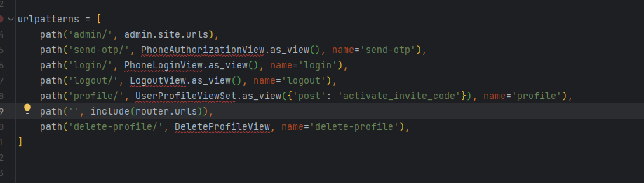

### Phone Number Authentication and Invite Codes

In this project, user authentication via phone numbers has been implemented. During the initial authentication, users receive a 6-digit verification code. Additionally, upon their first authentication, users are assigned a randomly generated 6-digit invite code.

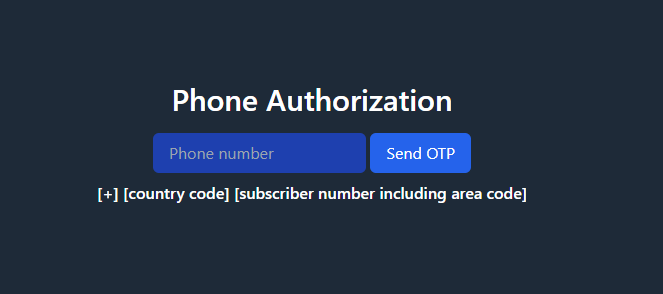
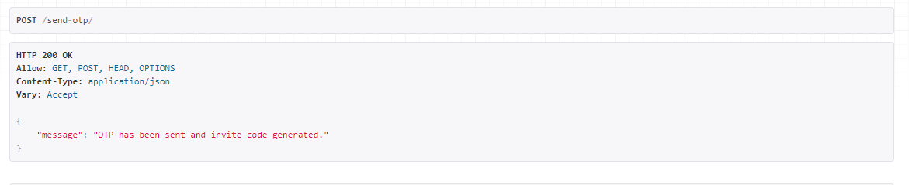
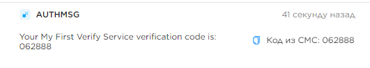
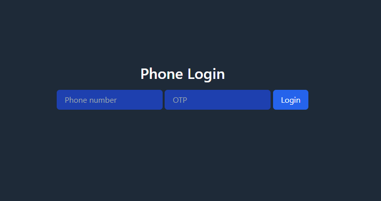
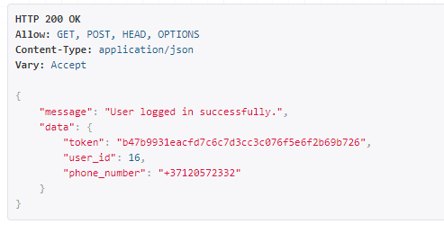

### Invite Code Entry and Activation

Users can input an invite code within their profile. Upon entering the code, a check is performed to validate its existence in the database. If the code exists and the user hasn't activated an invite code before, the code gets activated.
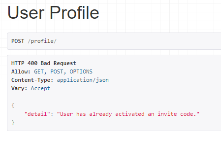

### List of Users with Activated Invite Codes

The profile API provides the ability to retrieve a list of users (phone numbers) who have entered the invite code of the current user.

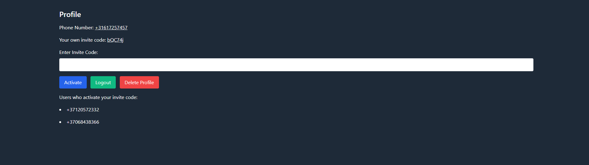

### Working with POST Requests and Error Handling

The project fully supports the functionality of necessary POST requests for authorization and invite code activation. Additionally, various error scenarios have been carefully addressed to ensure a more reliable and informative user interaction.

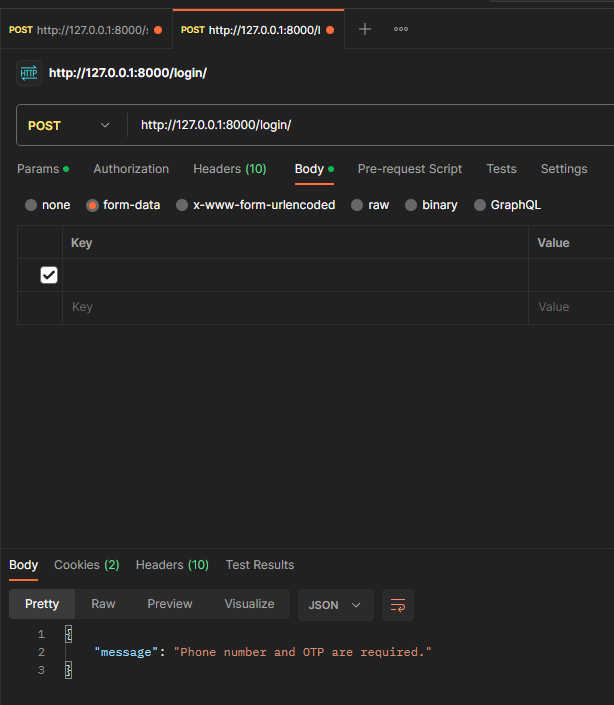
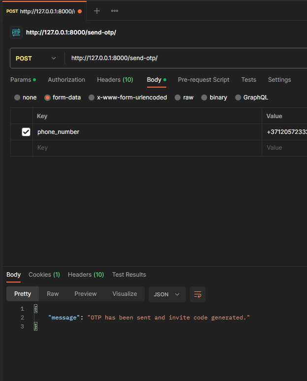
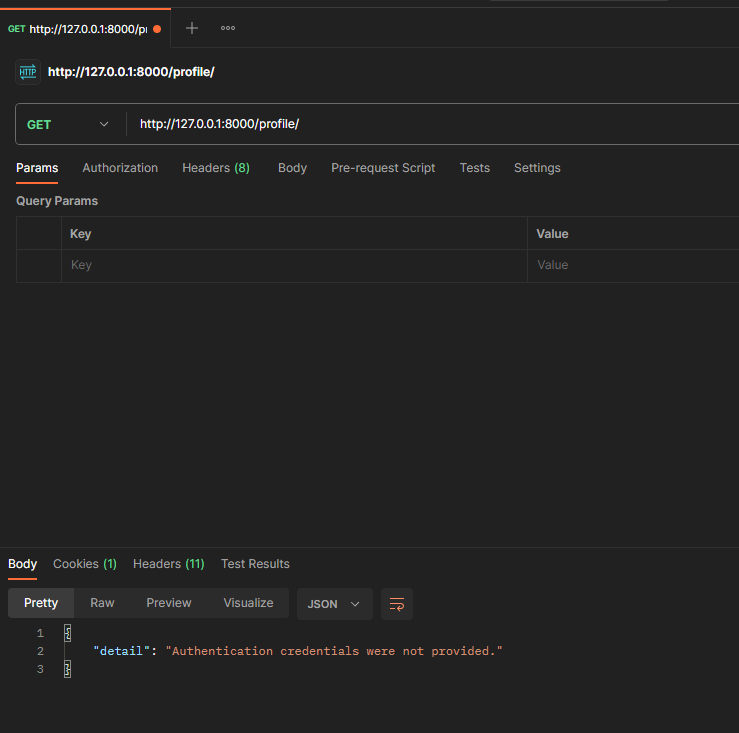

### Using PostgreSQL

This project utilizes PostgreSQL as its primary database management system. It ensures efficient and reliable data storage, retrieval, and management.